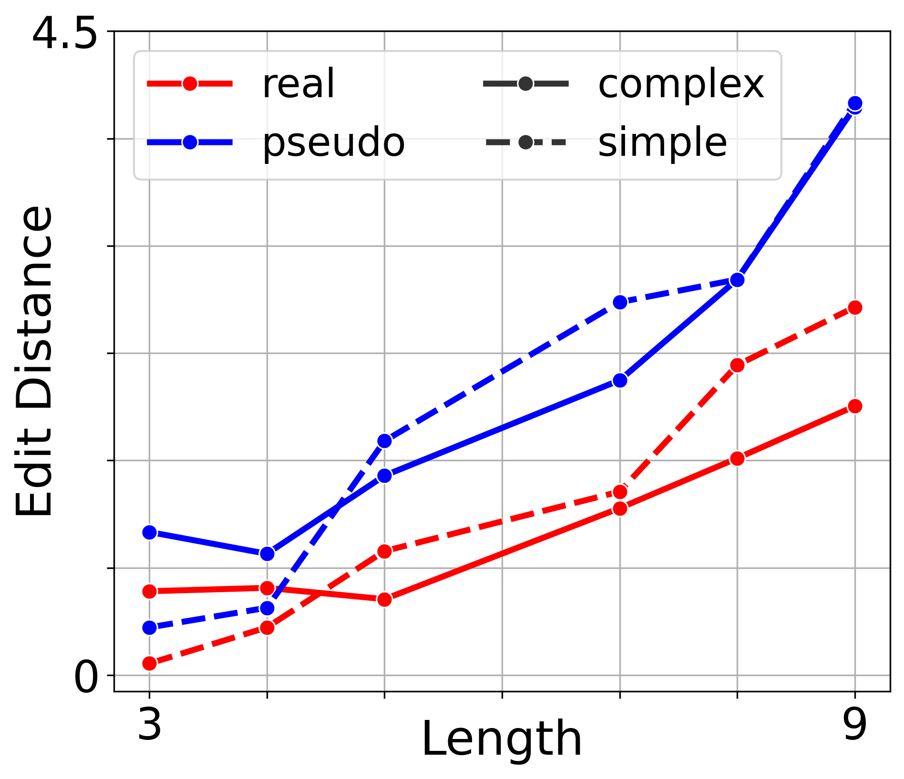
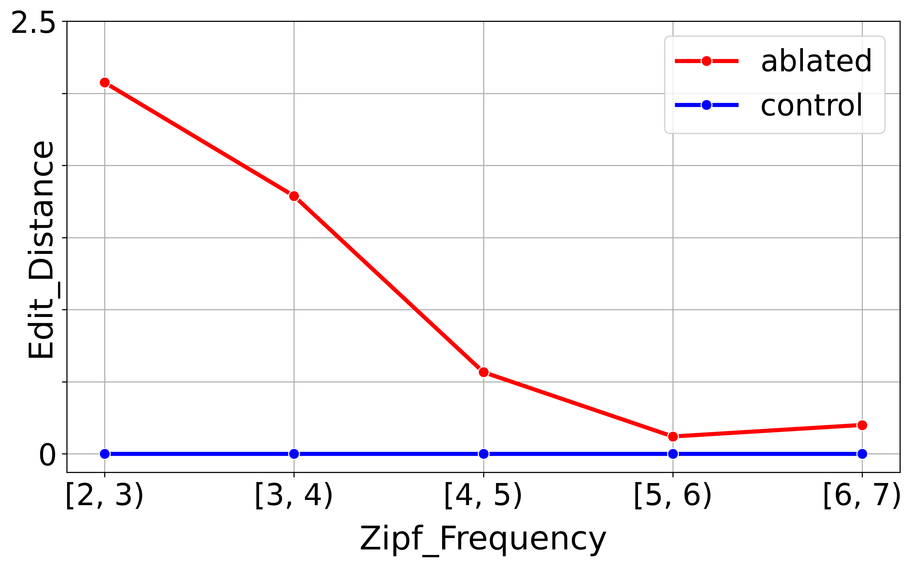
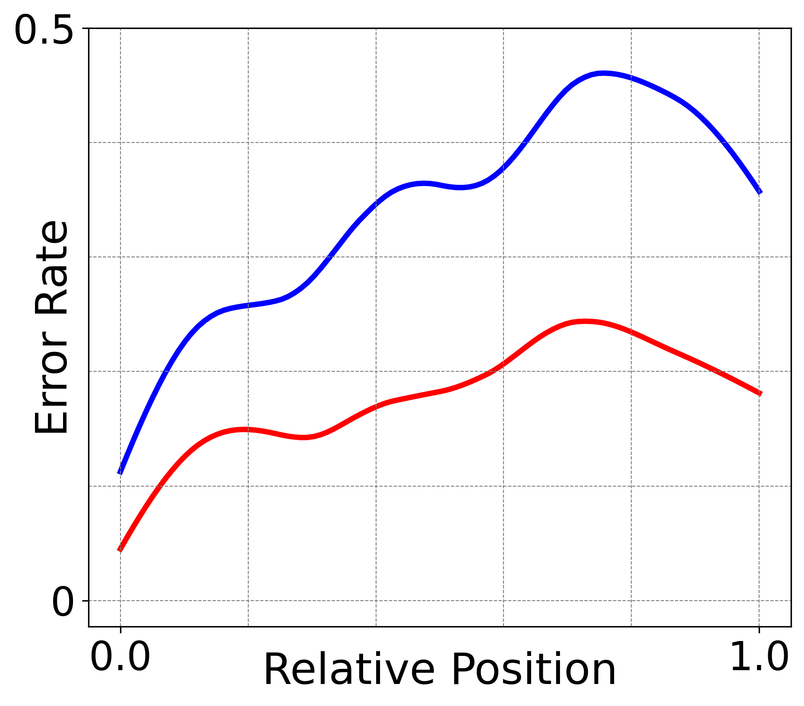
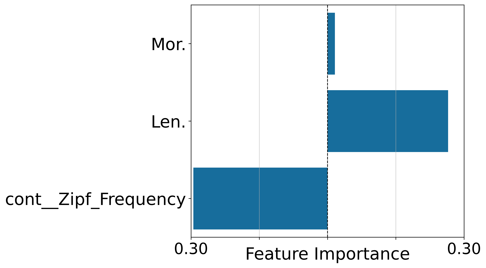
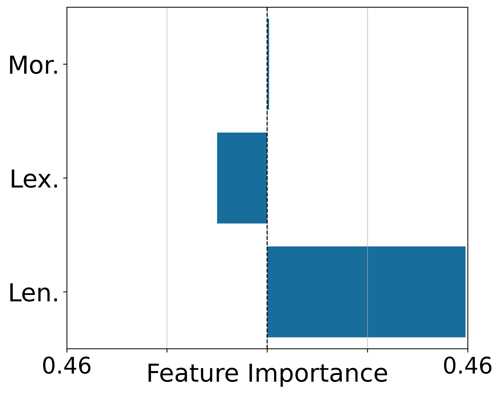

# A Neural Model for Word Repetition

> Abstract
>
> Word repetition — hearing a word and repeating it aloud — is a skill that takes years to develop in children, poses challenges for adults learning new languages, and can break down after brain damage. Cognitive science proposes a multi-component model for this task, but the underlying neural mechanisms remain unclear. To bridge this gap, we train deep neural networks on word repetition and probe them with tests inspired by human behavioral studies. We also simulate brain damage through ablation studies, creating “patient models” whose errors can be compared to clinical speech errors. Our results show that neural models can reproduce several human-like effects, while also diverging in important ways, pointing to both the promise and the challenges of developing biologically grounded models of language.

Neural models for single-word processing with an auditory repetition pathway. This repo supports training from scratch, evaluation on controlled datasets, and reproducing the paper’s figures and analyses. (swp = single word processing)

[](https://arxiv.org/abs/2506.13450)

## Table of contents

- [A Neural Model for Word Repetition](#a-neural-model-for-word-repetition)
  - [Table of contents](#table-of-contents)
  - [Setup](#setup)
    - [Training](#training)
    - [Load weights](#load-weights)
  - [Orthographic pathway (Ut): characters → phonemes (shared decoder)](#orthographic-pathway-ut-characters--phonemes-shared-decoder)
    - [Quick start](#quick-start)
    - [Outputs](#outputs)
    - [Code changes in this branch](#code-changes-in-this-branch)
    - [Example figures](#example-figures)
    - [Next steps](#next-steps)
  - [Repository structure](#repository-structure)
  - [Reproduce the paper figures](#reproduce-the-paper-figures)
  - [Reproducibility practices](#reproducibility-practices)
  - [Troubleshooting](#troubleshooting)
  - [Citations](#citations)

## Setup

```bash
git clone git@github.com:danieldager/swp-model.git
cd swp-model
python -m pip install --upgrade pip
pip install -r requirements.txt
python -m spacy download en_core_web_lg
pip install git+https://github.com/LouisJalouzot/MLEM_minimal.git
```

Optional conda

```bash
conda create -n swpm python=3.11 -y
conda activate swpm
```

Optional pyenv

```bash
pyenv install 3.11.0
pyenv virtualenv 3.11.0 swpm
pyenv activate swpm
```

### Training

Run the training script with your hyperparameters:

```bash
python scripts/train_repetition.py \
	--num_epochs 75 \
	--batch_size 1024 \
	--recur_type lstm \
	--hidden_size 128 \
	--num_layers 1 \
	--learn_rate 0.001 \
	--dropout 0.0 \
	--tf_ratio 0.0 \
	--seed 42 \
	--verbose
```

What gets saved where

- Checkpoints after each epoch (and 10 checkpoints in the first epoch): `weights/<model_name>/<train_name>/<epoch>.pth`
- Names are auto-generated for traceability:
  - `model_name` example: `Ua_LSTM_h128_l1_v42_d0.0_t0.0_s1`
  - `train_name` example: `b1024_l0.001_fall_s42_sn_ec`

### Load weights

```python
from swp.utils.models import get_model, load_weights
from swp.utils.setup import set_device

model_name = "Ua_LSTM_h128_l1_v42_d0.0_t0.0_s1"
train_name = "b1024_l0.001_fall_s42_sn_ec"
checkpoint = "75"  # epoch number or checkpoint like "1_3"

device = set_device()
model = get_model(model_name)
load_weights(model=model, model_name=model_name, train_name=train_name, checkpoint=checkpoint, device=device)

# model is now ready for evaluation/analysis
```

Alternatively, you can use the test script to evaluate and produce figures for a trained model:

```bash
python scripts/test_repetition.py \
	--model_name Ua_LSTM_h128_l1_v42_d0.0_t0.0_s1 \
	--train_name b1024_l0.001_fall_s42_sn_ec \
	--checkpoint 75 \
	--batch_size 1024 \
	--verbose
```

Outputs

- Results: `results/evaluation/<model_name>/<train_name>/<checkpoint>/...`
- Figures: `results/figures/<model_name>/<train_name>/<checkpoint>/evaluation/...`

## Orthographic pathway (Ut): characters → phonemes (shared decoder)

This branch adds an orthographic baseline `Ut` to the SWP model: written words (characters) are encoded with an RNN/LSTM and decoded into phonemes using the same decoder/output space as the auditory pathway (`Ua`).

**Why**: enables direct comparison between auditory repetition (phoneme→phoneme) and orthographic reading (char→phoneme) while keeping the decoding mechanism fixed.

**Key points**
- Shared phoneme decoder (same output vocab, same decoding/evaluation logic)
- New text encoder (`TextEncoderRNN/LSTM`) with its own embedding (char vocab ≠ phoneme vocab)
- New text dataset/dataloaders: `Word` → char ids (+ `<EOS>`) and targets are phoneme ids (+ `<EOS>`)
- Model naming supports: `Ut_...__g{char_vocab_size}` (example: `__g30`)

### Quick start
**Vocab sanity check**
```
python -c "from swp.utils.datasets import get_char_to_id, get_phoneme_to_id; print('char',len(get_char_to_id())); print('phon',len(get_phoneme_to_id(False)))"
```

**Train (example: 1 epoch smoke test)**
```
python scripts/train_text.py --num_epochs 1 --batch_size 64 --fold_id 0 --verbose
```

**Test + figures**
```
python scripts/test_text.py --model_name <Ut_MODEL_NAME> --train_name <TRAIN_NAME> --checkpoint <CKPT>
```

### Outputs

- `results/evaluation/<model_name>/<train_name>/<checkpoint>/control/evaluation.csv`
- `results/figures/<model_name>/<train_name>/<checkpoint>/evaluation/`

> `results/` is gitignored. For PR visibility, example figures are committed to `docs/figs/ut/`.

### Code changes in this branch

**Added:**
- `swp/datasets/text.py` — TextTrainDataset, TextTestDataset, text dataloaders
- `swp/train/text.py` — training loop for Ut models
- `swp/test/text.py` — evaluation loop for Ut models
- `scripts/train_text.py` — CLI entry point for training
- `scripts/test_text.py` — CLI entry point for evaluation
- `stimuli/chars_to_id.json` — character vocabulary (auto-generated, committed for reproducibility)
- `docs/figs/ut/` — example figures for PR review

**Modified:**
- `swp/models/encoders.py` — added `TextEncoder`, `TextEncoderRNN`, `TextEncoderLSTM`
- `swp/models/autoencoder.py` — fixed `Unimodel` to always define `is_auditory`/`is_text`/`is_visual`; updated forward dispatch
- `swp/utils/models.py` — added `TextArgs`, support for `Ut` model names with `__g{N}` suffix
- `swp/utils/datasets.py` — added `get_char_to_id()`, `create_char_to_id()`
- `swp/datasets/__init__.py` — exported text dataloaders

### Example figures

These plots are generated by `scripts/test_text.py` and saved to `docs/figs/ut/`.

> **Note:** These figures come from a 1-epoch smoke run (fold 0) for pipeline validation, not final performance.

**Length effect** | **Frequency effect**
:---: | :---:
 | 
Error rate increases with word length. | Errors higher for rarer words (lower Zipf bins).

**Position profile** | **Feature importance (real words)**
:---: | :---:
 | 
Error rate by relative phoneme position. | Regression summary on real-word items.

**Feature importance (pooled)** |
:---: |
 |
Same analysis on pooled conditions. |

### Next steps

`Ut` is a **symbolic orthography baseline**: it maps discrete characters to phonemes, bypassing pixel-level visual processing.

**Visual pathway (Uv) — planned:**
- **Primary approach:** rendered word images → CNN/CORnet encoder → same phoneme decoder. This is end-to-end pixel-to-phonology, enabling comparison with both `Ua` (auditory) and `Ut` (symbolic).

- **Optional control:** pixels → OCR → characters → `Ut` → phonemes. This OCR-bridged baseline isolates the contribution of visual feature extraction vs. orthographic-to-phonological mapping.

**Auditory front-end:** realistic auditory input (wav2vec, spectrograms) is handled on a separate branch and not documented here.

## Repository structure

Top-level folders:

- `swp/` — Core Python package
  - `datasets/` — Dataset loaders and helpers (phoneme folds, evaluation sets)
  - `models/` — Encoders/decoders and container models (auditory Unimodel)
  - `train/` — Training loops (e.g., `repetition.py` saves epoch checkpoints)
  - `test/` — Evaluation logic (behavioral metrics, error analysis)
  - `viz/` — Plotting utilities for figures and analyses
  - `utils/` — Paths, seeding, model name/args parsing, weight IO, grid tools
- `scripts/` — CLI entry points for training/eval and Slurm
  - `train_repetition.py` — Local training
  - `train_repetition.sh` — Slurm training wrapper (Jean Zay)
  - `test_repetition.py` — Evaluate checkpoints; save results + figures
  - `grid_search.sh` — Submit a grid of Slurm jobs
  - `local_test.sh` — Run Slurm scripts locally (no SBATCH)
  - `generate_queuer.py` — Generate job queue from a grid
- `reproduce/` — Reproduction code for paper figures
  - `scripts/` — Modular analyses (e.g., behavioral, embeddings, ablations, univariate)
  - `reproduce.ipynb` — Unified notebook to re-run figures
  - `datasets/` — CSVs used for reproduction (e.g., WFE, SSP)
- `stimuli/` — Data assets (folds, morphemes, handmade stimuli)
- `weights/` — Local checkpoints directory (auto-created)
- `results/` — Evaluation outputs and figures (auto-created)
- `notebooks/` — Additional analysis notebooks
- `ipa-dict/` — IPA resources
- `CORnet/` — External submodule

Key naming conventions

- `model_name`: Encodes architecture and hyperparameters (decoder type, hidden size, layers, vocab size, dropout, teacher-forcing, start token)
- `train_name`: Encodes training regime (batch size, learning rate, fold, seed, stress flag, loss type)

## Reproduce the paper figures

Run the modular scripts from `reproduce/scripts/` or use the master runner.

Run all analyses via the master script

```bash
cd reproduce/scripts
python run_all.py
```

Run an individual analysis (example: univariate feature importance)

```bash
cd reproduce/scripts
python univariate_analysis.py \
	--model-name Ua_LSTM_h128_l1_v42_d0.0_t0.0_s1 \
	--weights-path weights/1024_75.pth \
	--batch-size 1024 \
	--hidden-size 128
```

Use your own trained weights in analyses

- Pass a direct file path to `--weights-path`, e.g.:
  `weights/<model_name>/<train_name>/<epoch>.pth`
- Keep `--model-name` consistent with how you trained the model.

## Reproducibility practices

- Seeding: we call `seed_everything(42)` and set device consistently (`swp/utils/setup.py`).
- Paths: all save/load locations are centralized in `swp/utils/paths.py`. On Jean Zay, paths switch to `$WORK` automatically; locally they default to the repo folders.
- Caching: scripts save intermediate CSVs/NPYs to `results/` or `reproduce/data/` to avoid recomputation; use `--regenerate` where available to refresh.
- Naming: `model_name` and `train_name` encode configuration and regime for transparent experiments.
- Environment capture: consider exporting `pip freeze > requirements.lock` for archival of your exact environment.

## Troubleshooting

- FileNotFoundError for weights
  - If you run from inside `reproduce/scripts/`, relative paths resolve from that folder. Either run from repo root or pass absolute paths. For trained models, use: `weights/<model_name>/<train_name>/<epoch>.pth`.
- Missing packages (e.g., `sklearn`)
  - Install with `pip install -r requirements.txt`. On Slurm, the job scripts set up the env automatically.
- CUDA not found / GPU not visible
  - Check `python -c "import torch; print(torch.cuda.is_available())"`. On Slurm, ensure the proper module is loaded and `--gres` is set.

## Citations

Hannagan, T., Agrawal, A., Cohen, L., & Dehaene, A. S. (2021). Emergence of a compositional neural code for written words: Recycling of a convolutional neural network for reading. Proceedings of the National Academy of Sciences, 118(46), e2104779118.

Agrawal, A., & Dehaene, S. (2024). Cracking the neural code for word recognition in convolutional neural networks. arXiv preprint arXiv:2403.06159.

Agrawal, A., & Dehaene, S. (2023). Dissecting the neuronal mechanisms of invariant word recognition. bioRxiv, 2023-11.

Kubilius, J., Schrimpf, M., Nayebi, A., Bear, D., Yamins, D.L.K., DiCarlo, J.J. (2018) CORnet: Modeling the Neural Mechanisms of Core Object Recognition. biorxiv. doi:10.1101/408385

Kubilius, J., Schrimpf, M., Kar, K., Rajalingham, R., Hong, H., Majaj, N., ... & Dicarlo, J. (2019). Brain-like object recognition with high-performing shallow recurrent ANNs. In Advances in Neural Information Processing Systems (pp. 12785-12796).

Burgess, N., & Hitch, G. J. (1992). Toward a network model of the articulatory loop. Journal of memory and language, 31(4), 429-460.

Botvinick, M. M., & Plaut, D. C. (2006). Short-term memory for serial order: a recurrent neural network model. Psychological review, 113(2), 201.

Sajid, N., Holmes, E., Costa, L. D., Price, C., & Friston, K. (2022). A mixed generative model of auditory word repetition. bioRxiv, 2022-01.
